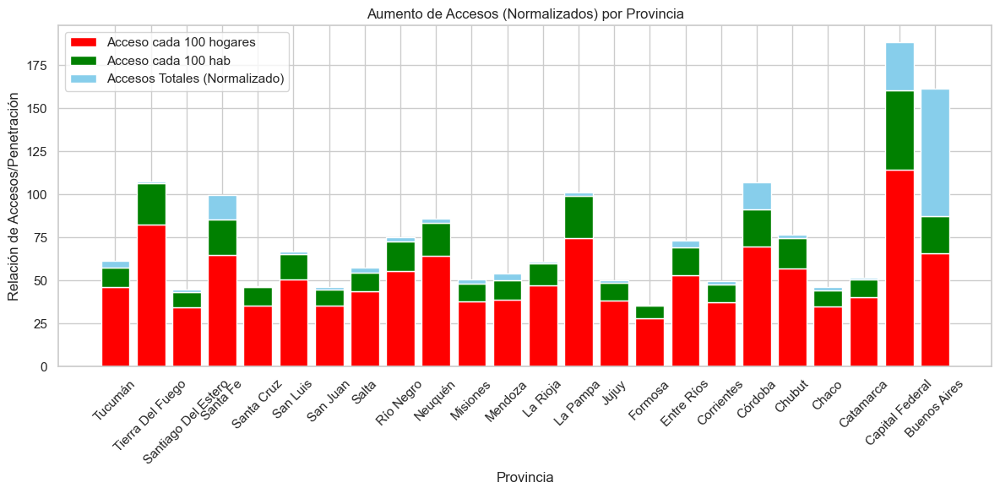
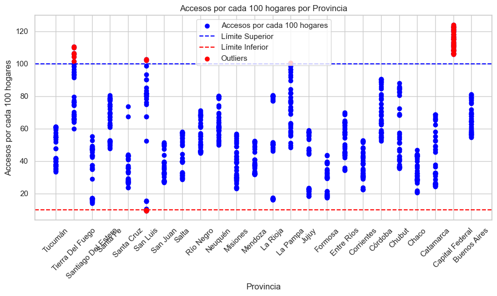
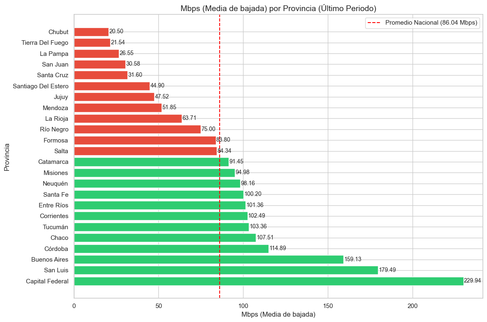
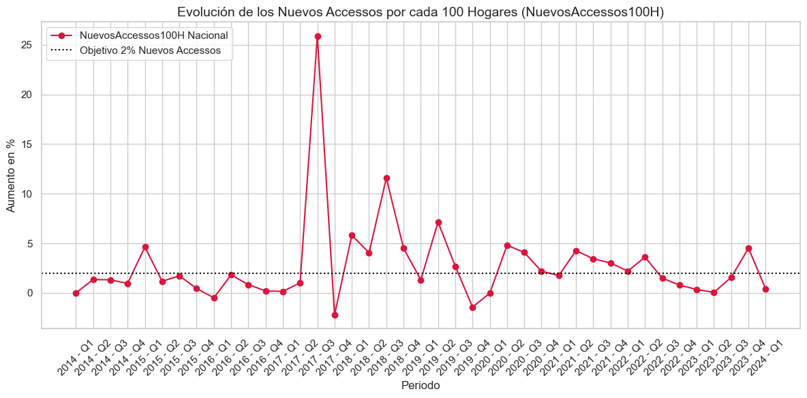
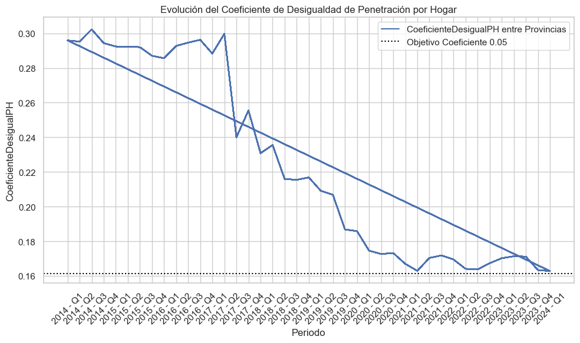
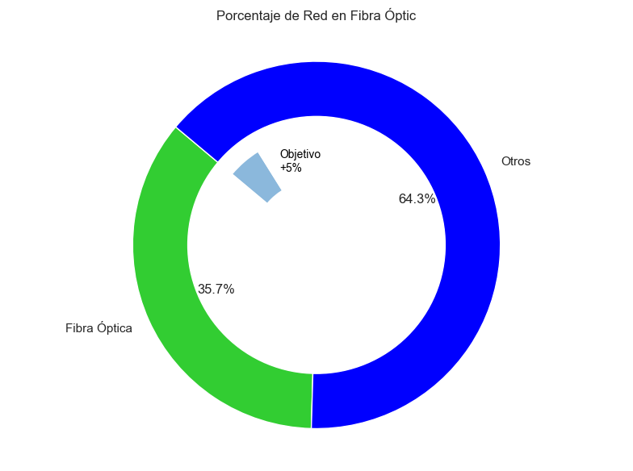

# Proyecto Individual 2 : Telecomunicaciones

## Descripcion

#### El Proyecto Individual N.º 2 es un análisis de datos desarrollado para ZataNet, una empresa de telecomunicaciones, que permite evaluar el comportamiento del acceso a internet a nivel nacional. A través de este análisis, se pueden consultar datos clave sobre la penetración del servicio en los hogares, identificar desigualdades entre provincias y obtener insights sobre nuevas oportunidades de expansión. Este proyecto proporciona a la empresa herramientas estratégicas para mejorar la calidad de sus servicios y personalizar soluciones según las necesidades de sus clientes potenciales.

## Contenido

1. [Introducción](#introducción)
2. [Instalación y Requisitos](#Instalación-y-Requisitos)
3. [Estructura del Proyecto](#Estructura-del-Proyecto)
4. [Ejecucion del proyecto](#Ejecucion-del-Proyecto)
5. [Formulación de KPIs](#formulación-de-kpis)
6. [Producción del Dashboard](#producción-del-dashboard)
7. [Conclusines](#conclusión)
8. [Sugerencias](#Sugerencias)
9. [Autor](#Autor)

## 1. Introducción

#### Este Proyecto consiste en la realización de un análisis de datos para ZataNet, una empresa proveedora de servicios de telecomunicaciones, cuya principal actividad es ofrecer acceso a internet. Este análisis permite obtener una comprensión detallada del comportamiento del sector a nivel nacional, lo que facilita a la empresa tomar decisiones informadas orientadas a mejorar la calidad de sus servicios. Además, el estudio identifica oportunidades de crecimiento y brinda información clave para diseñar soluciones personalizadas que respondan a las necesidades de sus potenciales clientes.
#### ZetaNet solicitó inicialmente la representación gráfica y medición de un KPI específico: aumentar en un 2% el acceso al servicio de internet en el próximo trimestre, medido por cada 100 hogares a nivel provincial. Sin embargo, tras revisar la vasta cantidad de información disponible, se recomendó incorporar la evaluación de dos KPI adicionales. Finalmente, se presentan conclusiones y sugerencias orientadas a mejorar la calidad del servicio ofrecido por la empresa.

## 2.Instalación y Requisitos

#### *Requisitos:*
#### 
- Python 3.11
- pandas
- numpy
- matplotlib
- seaborn
- scikit-learn

#### *Pasos de instalación:* 
####
- Clonar el repositorio: git clone https://github.com/mpaezgrecco/PI2_Telecomunicaciones 
- Crear un entorno virtual: python -m venv venv
- Activar el entorno virtual: Windows: venv\Scripts\activate macOS/Linux: source venv/bin/activate

### 3. Estructura del Proyecto

- Los datos utilizados en este proyecto han sido obtenidos de los conjuntos de datos abiertos proporcionados por el Ente Nacional de Comunicaciones (ENACOM). Puedes acceder a estos datos a través del siguiente enlace: [Datos Abiertos - ENACOM](https://indicadores.enacom.gob.ar/datos-abiertos)
- README.md: Archivo de documentación del proyecto.
- EDA1.ipynb: En este archivo se encuentra el proceso de Extracción, Carga y Transformación de los Datos (ETL) y a su vez el analisis exploratorio del mismo.
- Datos_EDA.csv: Archivo con los datos mas relevantes de acuerdo con el EDA. 
- Dashboard.pbix : Dashboard para presentacion de la informacion al cliente. 

### 4. Ejecucion del proyecto

### *Proceso de Extracción, Carga y Transformación de los Datos* 

#### Se inicia descargando los datos desde el enlace proporcionado, lo que permite obtener un archivo de Excel con 15 hojas, cada una con información relacionada con los servicios de internet de la empresa. A continuación, se procede con la carga de los datos para su posterior análisis. Sin embargo, debido al volumen de información, se realizó un análisis preliminar y superficial de cada hoja, con el objetivo de hacer una familiarizacion de datos y asegurar que se encontraran correctamente cargados. Esto incluyó la revisión de errores, valores faltantes, valores atípicos o extremos, outliers y posibles registros duplicados. Finalmente, se decidió qué conjuntos de datos aportaban información relevante para el análisis. Como parte de este proceso, se generaron gráficos simples para justificar las decisiones tomadas a lo largo del análisis.

### *Análisis Exploratorio de los Datos (EDA)*

#### Una vez que los datos fueron depurados y se identificaron posibles patrones y tendencias, comenzamos un análisis detallado con el objetivo de validar la información, así como los patrones e indicadores relevantes para la compañía.

#### dentro del analisis se puede evidenciar:

### 1. Acceso a internet: Es evidente que hay provincias con una penetracion de internet significativamente más alto, como Capital Federal, que tiene un acceso notablemente superior al promedio de otras provincias. Esto sugiere una infraestructura de internet más robusta en áreas urbanas.
#### 2. Diferencias Regionales: Las provincias con un crecimiento explosivo en el acceso a internet, como San Luis y Santa Cruz, podrían indicar el éxito de políticas de expansión de red. Su evolución sugiere que las iniciativas para mejorar la infraestructura están dando resultados positivos.
#### En contraste, provincias como Chaco y Catamarca parecen tener cifras más bajas en todos los indicadores, lo que indica que todavía hay mucho espacio para mejorar.
#### 3. Desigualdades en la distribución del acceso a internet: Las provincias menos desarrolladas tienden a estar rezagadas en comparación con las grandes urbes. Esto es un indicador de que la expansión del acceso a internet debe ser una prioridad para el gobierno y las empresas de telecomunicaciones.

#### 4. Se identificaron Outliers: Esto indica que en algunas provincias, el acceso por cada 100 hogares es significativamente diferente (más alto o más bajo) en comparación con la mayoría de las provincias.En particular, se observa que Capital Federal tiene un acceso notablemente más alto en comparación con otras provincias, lo que puede indicar una concentración de infraestructura o políticas de expansión más efectivas.
#### 5. Tendencias Regionales: Algunas provincias, como Tierra del Fuego y Santa Cruz, parecen tener acceso por cada 100 hogares que se aproxima al límite inferior. Esto podría indicar la necesidad de políticas de mejora de infraestructura en esas áreas.
### Provincias como Córdoba y Buenos Aires muestran accesos bastante más altos, lo que sugiere una infraestructura más desarrollada y un mayor acceso a internet.

#### 5. Provincias con mejor velocidad de internet: Capital Federal tiene la velocidad media más alta (229.94 Mbps), seguida por Buenos Aires (179.49 Mbps) y San Luis (159.13 Mbps). Esto sugiere que estas áreas tienen una infraestructura de internet significativamente más desarrollada. Estas provincias son clave para el acceso a servicios digitales, comercio electrónico y educación en línea, lo que podría impactar positivamente en el desarrollo económico y social.
#### 6. Provincias con Peores Conexiones: Provincias como Chubut (20.50 Mbps) y Tierra Del Fuego (21.54 Mbps) presentan las velocidades más bajas, indicativo de una infraestructura deficiente. Esto puede limitar el acceso a servicios digitales y afectar negativamente la calidad de vida de los residentes. 
#### La falta de acceso adecuado a internet en ciertas provincias puede tener repercusiones en diversos ámbitos, como la educación, el trabajo remoto y el desarrollo empresarial.

#### la calidad de la velocidad de internet no se correlaciona necesariamente con el nivel de penetración. Alta penetración no garantiza alta velocidad, en regiones donde el acceso a internet es elevado (alta penetración), la velocidad de conexión puede ser baja debido a múltiples factores, como la infraestructura limitada, sobrecarga de redes, o calidad de los proveedores de servicios.

### 5. Formulación de KPIs

#### *1. Nuevos Accesos Cada 100 Hogares:*
#### Propongo denominar como Nuevos Accesos Cada 100 Hogares al indicador clave de rendimiento (KPI) solicitado por el cliente. Este KPI refleja el crecimiento de la infraestructura de acceso a internet a nivel provincial. Un objetivo razonable de incremento del 2%. Es factible en regiones con menor conectividad, donde la mejora en el acceso puede ser más rápida. Sin embargo, en ciertas provincias con un desarrollo avanzado en infraestructura, alcanzar este objetivo puede resultar un desafío considerable. 
 
#### Se puede observar que el comportamiento de los últimos trimestres muestran un crecimiento bastante irregular, con pocos trimestres superando el 2%. Incluso, algunos periodos tienen una variación negativa o cercana al 0%.
#### En los trimestres más recientes (2022-2024), el crecimiento es bastante moderado, sin alcanzar el 2% de aumento en la mayoría de los casos. Esto indica que se deben hacer algunas intervenciones importantes (políticas, inversiones en infraestructura, incentivos), para mantener mantener un crecimiento sostenido del 2% en tan poco tiempo.En este sentido, Nuevos Accesos Cada 100 Hogares se erige como una herramienta valiosa para evaluar el crecimiento bruto de la red, proporcionando una perspectiva clara sobre la expansión y la eficacia de las iniciativas de acceso a internet.

#### *2. Coeficiente de Desigualdad de Penetración por Hogar:* 
#### indicador clave para evaluar el aprovechamiento óptimo de las oportunidades de expansión y garantizar un progreso sostenible. Este KPI se calcula aplicando el Coeficiente de Gini al número de accesos por cada 100 hogares en cada provincia, lo que permite medir las disparidades en la penetración de internet entre regiones. Su utilidad radica en la capacidad de identificar áreas con menor conectividad y asegurar un desarrollo equitativo en todo el país, maximizando las oportunidades de expansión de la red y promoviendo un crecimiento equilibrado.
 
#### Se observa una tendencia a la baja en el coeficiente desde aproximadamente 2014 hasta el final del período. Esto sugiere que la desigualdad en el acceso a internet por hogar ha disminuido, lo cual es *positivo*, ya que indica una mejor distribución del acceso a la tecnología entre las provincias.
#### Desde alrededor de 2020, el coeficiente parece estabilizarse alrededor de 0.16-0.18. Esto podría indicar que, aunque la desigualdad ha disminuido, ha alcanzado un punto de equilibrio donde las diferencias en acceso son menores, pero no se ha logrado una igualdad total.
#### La línea punteada en *0.05 representa un objetivo de desigualdad* que parece no haber sido alcanzado. Esto sugiere que, aunque hay mejoras, todavía hay un margen considerable para reducir la desigualdad y alcanzar el nivel deseado de equidad en el acceso.

#### *3.Porcentaje de Red en Fibra Óptica:* 
#### Durante el EDA se identifico una correlación significativa y casi directa entre la calidad de la red de internet, medida en la velocidad media de bajada, y el aumento del porcentaje de fibra óptica en la infraestructura. Este KPI resulta particularmente útil, ya que es un indicador más tangible que la velocidad promedio y menos dependiente de las variaciones en la capacidad económica de los usuarios. Su implementación permite una evaluación más objetiva del progreso en la calidad de la red y su capacidad de ofrecer servicios de alta velocidad de manera equitativa.

#### "Objetivo +5%" resalta la aspiración de aumentar la cobertura de fibra óptica, lo que puede tener implicaciones significativas en la calidad del servicio y el acceso a internet. Un mayor porcentaje de fibra óptica generalmente se asocia con una mejor calidad de servicio, ya que esta tecnología ofrece velocidades de internet más rápidas y conexiones más estables en comparación con otras tecnologías
#### Este gráfico proporciona una visión clara de la penetración de la tecnología de fibra óptica en la provincia, lo que puede ser útil para la toma de decisiones políticas y de inversión en infraestructura.

### 6. Producción del Dashboard
#### Una vez finalizado el análisis, se procede a la creación de un dashboard. Los datos se cargan en la herramienta de Business Intelligence seleccionada (en este caso, PowerBI) con el objetivo de presentar la información relevante obtenida en el análisis exploratorio de datos (EDA) y visualizar los KPI definidos. El dashboard consta de una portada simple y cuatro páginas, donde se incluyen los gráficos más representativos relacionados con la generación de cada indicador.

### 7. Conclusiones 

#### 1. Existe una brecha en el acceso a internet en Argentina, destacando la desigualdad entre provincias. Las disparidades en las velocidades de conexión sugieren la necesidad de acciones políticas y estratégicas para mejorar la infraestructura en las provincias con menor acceso, con el fin de fomentar un desarrollo más equilibrado y equitativo en el país.

#### 2. el panorama de las telecomunicaciones en Argentina ofrece grandes oportunidades de crecimiento, donde la reducción de desigualdades regionales y la modernización tecnológica son clave para asegurar un futuro con mayor conectividad y equidad digital.

#### 3. La disparidad en el acceso puede tener implicaciones significativas en la educación, la economía y la calidad de vida en las provincias con menos acceso.

### 8. Sugerencias:

#### *1. Margen de Mejora en Acceso y Penetración:*
#### Aunque Argentina muestra un nivel razonable de acceso a internet en la población, existe un margen significativo para continuar expandiendo la red a nivel nacional. En particular, las provincias con baja penetración representan oportunidades clave para políticas que promuevan la igualdad en conectividad.

#### *2. Reducción de la Desigualdad Regional:*
#### La disparidad entre provincias con altos niveles de penetración, como Buenos Aires y Córdoba, frente a otras que se encuentran muy por debajo del promedio nacional, subraya la necesidad de reducir las brechas digitales. Es esencial priorizar inversiones y políticas que promuevan un desarrollo más equilibrado en todo el territorio, garantizando que el acceso a internet sea una realidad para todas las regiones.

#### *3. Modernización de Infraestructura Tecnológica:*
#### El análisis revela una correlación directa entre la calidad del servicio de internet y las tecnologías utilizadas. Regiones que dependen de tecnologías más antiguas, como el ADSL o el Wireless, tienden a presentar menores velocidades de conexión y menores niveles de penetración. Un objetivo estratégico a largo plazo debería centrarse en la modernización de estas infraestructuras, promoviendo la transición hacia tecnologías más avanzadas, especialmente la Fibra Óptica, que ofrece mayor estabilidad y velocidades superiores.

#### *4. Identificación de Áreas de Crecimiento Potencial:*
#### Provincias como San Luis han demostrado un crecimiento exponencial en el acceso a internet, lo que sugiere que regiones previamente desatendidas pueden convertirse en focos de expansión significativa. La Rioja, Entre Ríos, y Jujuy también presentan un potencial de crecimiento notable que debería ser aprovechado mediante inversiones focalizadas y estrategias gubernamentales que incentiven la adopción y el desarrollo de infraestructura tecnológica.

#### *5. Impulso a la Innovación y la Equidad Tecnológica:*
#### La mejora de la conectividad no solo requiere mayor acceso, sino también la innovación en las tecnologías disponibles y una mayor equidad en su distribución. Fomentar el acceso a tecnologías de última generación en todas las provincias garantizará un progreso más sostenible, logrando cerrar las brechas regionales y promoviendo la igualdad digital en todo el país.

### 9. Autor

#### Este proyecto fue realizado por: Maria Jose Paez Grecco 
#### Mail: mpaezgrecco@gmail.com
#### Linkedin: [Linkedin_MariaJosePaezGrecco](https://www.linkedin.com/in/maria-jose-paez-grecco-78a155192/)

